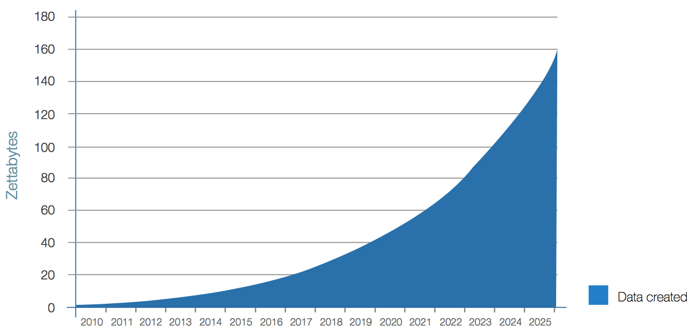

```{r setup, include=FALSE}
options(htmltools.dir.version = FALSE)
```

class: inverse, center, middle

# The Era of Data

---

class: center, middle

```{r, echo = FALSE, out.width = "75%"}
knitr::include_graphics("media/internet-minute-2018.jpg")
```

Source: [www.visualcapitalist.com](http://www.visualcapitalist.com/internet-minute-2018/)

---

class: center, middle

# Annual size of the global datasphere

```{r, echo = FALSE, out.width = "110%"}

```

Source: [www.storagenewsletter.com](https://www.storagenewsletter.com/2017/04/05/total-ww-data-to-reach-163-zettabytes-by-2025-idc/)

---

class: big-font, center

- Current estimate of data generated today (2018): 

.red[approximately 40 zettabytes]

<br/>

--

- Forecast of data generated in 2020: 

.red[approximately 60 zettabytes]

<br/>

--

- Forecast of data generated in 2025: 

.red[approximately 163 zettabytes]

---

class: center, middle

.very-big-font[
.red[What is a zettabyte?]
]


---

class: big-font, center

- 1 zettabyte = .red[10<sup>21</sup> bytes]

--

100000000000000000000 bytes!!!

<br/>
--

- 1 zettabyte = .red[1 quadrillion megabytes]

<br/>
--

- 1 zettabyte = .red[1 trillion gigabytes]

<br/>
--

- 1 zettabyte = .red[1 billion terrabytes]

<br/><br/>
---

class: center, middle

.very-big-font[
.red[Let's put these values in perspectives!]
]

```{r, echo = FALSE, out.width = "80%"}
knitr::include_graphics("https://media.giphy.com/media/uhuUMkxBEgVz2/giphy.gif")
```

---

class: center, big-font

1 terabyte = 1 kilometer (approximately 0.6 mile)

--

1 zettabyte = .red[1,300 round trips to the moon and back!]

[Shruti Jain](https://blogs.cisco.com/author/shrutijain)

```{r, echo = FALSE, out.width = "70%"}

```

Source: [www.zmescience.com](https://www.zmescience.com/space/the-moon-is-moving-away-from-earth-and-this-is-making-days-longer/)

---

class: center, big-font

1 gigabyte = 1 brick

--

1 zettabyte = .red[250 Great Walls of China]

(made of 3,873,000,000 bricks)

[Taru Khurana](https://blogs.cisco.com/author/tarukhurana)

```{r, echo = FALSE, out.width = "60%"}

```

Source: [www.archaeology-travel.com](https://archaeology-travel.com/my-bucket-list/great-wall-of-china/)

---

class: center, big-font

Still confusing???

--

.red[
.very-big-font[Amount of data today!]
]

```{r, echo = FALSE, out.width = "80%"}
knitr::include_graphics("https://media.giphy.com/media/ZTjQgJGDiuJZS/giphy.gif")
```

---

class: center, big-font

## What is data science?

Data science is the process of turning data into valuable products.

<br/>
--


.red[
Data = Raw material

Data science = Processing

Result = Awesomeness!
]

---

class: inverse, center, middle

# How will I benefit from the seminar?

---

class: center, big-font

## 3 Reasons why data science jobs are in high demand

<br/>

- Lack of qualified talent

- Organizing data is hard

- Companies of all sizes are hiring

<br/>

Source: [www.woz-u.com](https://woz-u.com/these-3-trends-explain-why-data-science-jobs-are-in-high-demand/)

---

class: center

## Rising demand for data scientists

```{r, echo = FALSE, out.width = "70%"}

```

---

class: center, middle, big-font

## The Data Scientist Shortage

.red[
[Infographic](https://insidebigdata.com/2018/08/19/infographic-data-scientist-shortage/)
]

---

class: center, big-font

## Important!!!


&#10006; : Change your career!

--

&#10004; :  Enhance your career!


```{r, echo = FALSE, out.width = "60%"}
knitr::include_graphics("https://media.giphy.com/media/MLZYKauKxeqKk/giphy.gif")
```

---

class: inverse, center, middle

# What exactly will I learn in the seminar?

---

class: center

## The data science process

<br/> <br/>


```{r, echo = FALSE, out.width = "100%"}
knitr::include_graphics("media/data-science-process.png")
```


---

class: inverse, center, middle

# What tool will we use in the seminar?

---

class: center, big-font, center, middle

```{r, echo = FALSE, out.width = "75%"}
knitr::include_graphics("media/R-logo.png")
```

---

class: inverse, center, middle

# Why R?

---

class: center, big-font

# R is free!

- [Stata](https://www.quantec.co.za/software/stata/)

- [Matlab](https://www.mathworks.com/pricing-licensing.html)

--

- [SAS](https://thepinnaclesolutions.com/buy-sas/?gclid=CjwKCAjwuO3cBRAyEiwAzOxKsgQy1IwW8nrvZiFagd07o_Vm0ybzYCeJiVxGvop4kfeO-QgBmggS6hoChV0QAvD_BwE)

--

```{r, echo = FALSE, out.width = "65%"}
knitr::include_graphics("https://media.giphy.com/media/NMufrvxO8fC3C/giphy.gif")
```

---

class: center

# R has a great community!

- **#rstats**: hashtag for R

- **Stackoverflow**: [www.stackoverflow.com](https://stackoverflow.com/)

- **Free webinars**: e.g. [Rstudio webinars](https://resources.rstudio.com/the-essentials-of-data-science)

- **Free video courses**: e.g. [MarinStatsLectures on Youtube](https://www.youtube.com/watch?v=riONFzJdXcs&list=PLqzoL9-eJTNBDdKgJgJzaQcY6OXmsXAHU)

- **Free ebooks**: e.g. [www.bookdown.org/home/archive/](https://bookdown.org/home/archive/)

- **Free tutorials**: e.g. [100 free tutorials for learning R](https://www.listendata.com/p/r-programming-tutorials.html)

- **Local meetups**:

  - e.g.1 [R User Groups](https://jumpingrivers.github.io/meetingsR/r-user-groups.html)
  
  - e.g.2 [R-Ladies Groups](https://jumpingrivers.github.io/meetingsR/r-ladies-groups.html)
  
  - e.g.3 [R conferences](https://jumpingrivers.github.io/meetingsR/events.html)

<br/>

--

.red[MORE IMPORTANTLY...]

---

class: center, middle

.very-big-font[.red[THE LOUISIANA TECH UNIVERSITY DATA SCIENCE SEMINAR!!!]]

```{r, echo = FALSE, out.width = "70%"}
knitr::include_graphics("https://media.giphy.com/media/14udF3WUwwGMaA/giphy.gif")
```

---

class: center, middle, big-font

# R is open!

*"The term "open source" refers to something people can modify and share because its design is publicly accessible."*

*"Open source projects, products, or initiatives embrace and celebrate principles of open exchange, collaborative participation, rapid prototyping, transparency, meritocracy, and community-oriented development."*

Source: [www.opensource.com](https://opensource.com/resources/what-open-source)

---

class: center, middle, big-font

# R is powerful!

- Works with many kinds of data

- Fancy graphics

- Powerful statiscal libraries/packages

- Machine learning/Deep learning

- Image processing

- Reporting

- Web

- Many more...

---

class: center, big-font

### Web apps (examples):

  - [Airbnb visualization](https://yuyuhan0306.shinyapps.io/airbnb_yuhan/)
  
  - [Pixel art modeling](https://florianprive.shinyapps.io/pixelart/)
  
  - [More web apps](https://www.rstudio.com/products/shiny/shiny-user-showcase/)

---

class: center, big-font

### Visualizations (examples)

  - [Various visualizations of data](http://r-statistics.co/Top50-Ggplot2-Visualizations-MasterList-R-Code.html)
  
  - [Olympic medals](https://www.washingtonpost.com/graphics/sports/olympics/the-1000-medals-of-the-united-states/?noredirect=on)
  
  - [Vaccination simulation](https://www.theguardian.com/society/ng-interactive/2015/feb/05/-sp-watch-how-measles-outbreak-spreads-when-kids-get-vaccinated)
  
  - [Income distribution in the USA](https://flowingdata.com/2016/06/28/distributions-of-annual-income/)
  
  - [Sam talks too much!](http://www.datasketch.es/july/code/nadieh/)
  
  - [Music](http://www.datasketch.es/december/code/nadieh/)

---

class: center, big-font

# R is popular!

<br/>

```{r, echo = FALSE, out.width = "80%"}
knitr::include_graphics("media/companies-using-R.png")
```

Source: [www.listendata.com](https://www.listendata.com/2016/12/companies-using-r.html)

---

class: inverse, center, middle

# Time to dive in!

# Open RStudio

---

class: center, middle

```{r, echo = FALSE, out.width = "110%"}

```

---

class: center, big-font

## A few definitions:

- .red[A code/script]:

<blockquote> A set of instructions <b>you</b> give the computer to perform various tasks.  </blockquote>

- .red[A function]:

<blockquote> A specific instruction given to the computer </blockquote>

- .red[A package]:

<blockquote> A set of functions created by other users freely available to everyone. Packages can also contain data sets. </blockquote>

---

class: center, big-font

## Important advice!

### Do related work inside RStudio projects!!!

1. Create a folder in which your work will reside.

2. File > New Project > Existing directory > Create Project


### Be organized. Create a directory for similar files!!!

E.g. Data, Plots, Documents, Media, R scripts...

---

### .center[Use lots of comments for your future self!!!]

Comments are chunks of text which are not executed by R. They are used to guide the user in the code. Comments are preceded by a `#` symbol.

---

```{r, outwidth = "75%"}
# Plot of the Iris data set color-coded by species
plot(iris, pch = 20, col = iris$Species)
```

---

class: center, inverse, middle

# Let's get started with the titanic data set!!!
