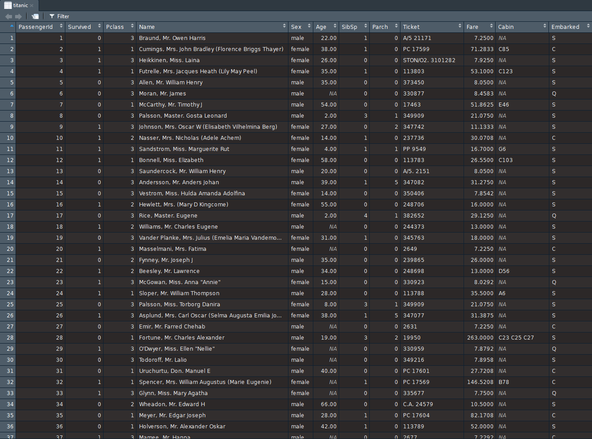

```{r setup, include=FALSE, comment = NA}
options(htmltools.dir.version = FALSE)
```

class: center, middle

```{r, echo = FALSE, out.width = "110%"}
knitr::include_graphics("media/titanic.jpg")
```

Source: [www.britannica.com](https://www.britannica.com/topic/Titanic/images-videos/media/597128/7788)

---

class: inverse, center, middle

 # A few facts about the Titanic

---

class: center, middle

- Full name: Royal Mail Ship (RMS) Titanic

- Length: 269m (882.5 feet)

- Width: 28.2m (92.5 feet)

- Carrying capacity: 46,328 tons

- Was built in Belfast (Ireland)

- Many claimed that the Titanic was unsinkable (source: [www.britannica.com](https://www.britannica.com/topic/Titanic))

- The Titanic sank during its .red[maiden voyage].

- Date of the tragedy: April 14-15, 1912

---

class: inverse, center, middle

# Initial setup

## Be very organized in your work!

---

A- Create a folder in a location of your choice: .red[`Data_Science_Seminar`].

- Let it be the master folder for everything you do in the seminar.
    
- Avoid \*spaces\* when you name things.

--

B- Create a subfolder inside the master folder for the analysis of the Titanic data: .red[`titanic_analysis`].

- This is where everything related to the analysis will reside: 
    
- Creating sub-folders for similar file types is a very good habit to have: R scripts, graphs, data, reports, ...

--

C- `titanic_analysis` is the **root folder/directory** of our project. We need to make sure RStudio knows it!

- Open RStudio (the top-right corner should say: "Project: (None)").
    
- File > New project > Existing directory > Browse...
    
- ... Look for the `titanic_analysis` folder and click on it.
    
- Click the "Open" button.
    
- Click the "Create project" button.

---

class: center

- The top-right corner of RStudio should now have: `titanic_analysis` - the name of your project.

- The actual `titanic-analysis` root folder has a new file with the same name (with the extension *R Project*).

- Now RStudio recognizes the folder you created as the root folder of your project!

--


### .red[Time to download the data into our root folder]

Place it in a subfolder called .red[data].

Link: [titanic.csv](http://bit.ly/2po1gQu)

--

### .red[Exercise]

Create a new folder called `fastfood_nutrition` and make it the root folder of an RStudio project!

Link: [fastfood_calories.csv](http://bit.ly/2NqGnmd)


---

class: inverse, center, middle

## Let's Get to Know our Data

---

class: left

- The data is a .red[data frame].

- Each column is a **variable**.

- Each row is an **observation**.

--

.pull-left[
- .blue[`PassengerId`]: Identification number of each passenger.

- .blue[`Survived`]:

    - 0: did not survive
    
    - 1: survived

- .blue[`Pclass`]: Passenger class

    - 1: first class
    
    - 2: second class
    
    - 3: third class

- .blue[`Name`]: Name of each passenger

- .blue[`Sex`]: Gender of each passenger
]

.pull-right[
- .blue[`Age`]: Age of each passenger

- .blue[`SibSp`]: Siblings and spouse

- .blue[`Parch`]: Parents and children

- .blue[`Ticket`]: Ticket number

- .blue[`Fare`]: Price paid for the voyage

- .blue[`Cabin`]: Cabin number

- .blue[`Embarked`]: City of origin

    - S: Southampton (England)
    
    - C: Cherbourg (France)
    
    - Q: Queenstown (Ireland)
]


---

class: inverse, middle, center

# Let's Gear up!

```{r, echo = FALSE, out.width = "100%"}
knitr::include_graphics("https://media.giphy.com/media/6Si7a90lnHTOg/giphy.gif")
```

---

class: big-font

## What is a function?

A specific instruction given to the computer.

E.g. `filter()`, `sum()`, `all.equal()`, ...

--

```{r, comment = NA}
lm
```

---

class: big-font

## What is a function?

.center[A function is a tool!]

.center[
```{r, echo = FALSE, out.width = "60%"}
knitr::include_graphics("https://media.giphy.com/media/3oKIPqsXYcdjcBcXL2/giphy.gif")
```
]

---

class: center, big-font

## What is a package?

A collection of functions.

A package can also contain data.

--

Actually, there are data packages!

e.g. `wooldridge`, `Ecdat`, `datasets`, ...


---

class: center, big-font

## What is a package?

A package is a tool box!

```{r, echo = FALSE, out.width = "40%"}
knitr::include_graphics("https://media.giphy.com/media/XIm5w1pgUmyc0/giphy.gif")
```

---

class: big-font, center, middle

## Create a new R script

File > New File > R Script

This is where you'll write all your code!

---

class: big-font

## Installing a package

- R comes with many packages.

- Many more are developed by the community and made available for free!

--

```{r, eval = FALSE}
install.packages("readr") # For importing data into R
install.packages("dplyr") # For manipulating data
install.packages("ggplot2") # For visualizing data
```

Execute the code with:

- `Ctrl + Enter` (Windows)

- `Cmd + Enter` (Mac)

.red[Once a package is installed once, it's installed forever!]

---

class: big-font

## Loading a package

- Loading a package = opening the toolbox

- Need to do it whenever you need to use the tools inside the package

--

```{r, message = FALSE, warning = FALSE, comment = NA}
library(readr) # For importing data into R
library(dplyr) # For manipulating data
library(ggplot2) # For visualizing data
```

---

class: inverse, center, middle

# Import the data

---

class: big-font

## `read_csv` (in the `readr` package)

```{r, message = FALSE, warning = FALSE, comment = NA}
read_csv("data/titanic.csv")
```

---

class: big-font

The data set can be stored inside .red[a variable].

```{r, message = FALSE, warning = FALSE, comment = NA}
titanic <- read_csv("data/titanic.csv")
titanic
```

Now, the .red[variable] shows up in the .blue[environment].

---

class: big-font

Get a glimpse of the data set

```{r, comment = NA}
glimpse(titanic)
```

---

class: big-font

View the entire data set in a spreadsheet format.

```{r, eval = FALSE}
View(titanic)
```

```{r, echo = FALSE, out.width = "90%"}

```

---

class: inverse, center, middle

# Manipulate the data

---

class: big-font, center, middle

## `filter` (in the `dplyr` package)

### *Remove unwanted material.*


```{r, echo = FALSE, out.width = "80%"}
knitr::include_graphics("https://media.giphy.com/media/5xtDarIwkXunoCmm7XG/giphy.gif")
```

---

class: big-font

.blue[Who are the adults in the titanic?]

```{r}
filter(titanic, Age >= 18)
```

---

class: big-font

.blue[Who are the senior citizens in the titanic?]

```{r}
filter(titanic, Age >= 60)
```

---

class: big-font

.blue[Who are the survivors?]

```{r}
filter(titanic, Survived == 1)
```

---

class: big-font

.blue[Who died after the tragedy?]

```{r}
filter(titanic, Survived == 0)
```

---

class: big-font

.blue[The women on the Titanic]

```{r}
filter(titanic, Sex == "female")
```

---

class: big-font

.blue[The men on the Titanic.]

```{r}
filter(titanic, Sex == "male")
```

---

class: big-font

.blue[The teenagers on the Titanic]

```{r}
filter(titanic, Age >= 13, Age < 20)
```

---

class: big-font

.blue[Was there any baby on the Titanic without the parents?]

```{r}
filter(titanic, Age <= 2, Parch == 0)
```

---

class: big-font

.blue[All passengers except those from Southampton.]

```{r}
filter(titanic, Embarked != "S")
```

---

class: big-font

.blue[Any lonely senior citizen from Queenstown?]

```{r}
filter(titanic, Embarked == "Q", Age >= 60, Parch == 0, SibSp == 0)
```

---

class: big-font, center, middle

## `arrange` (in the `dplyr` package)

### *Put (things) in a neat, attractive or required order.*

```{r, echo = FALSE, out.width = "30%"}
knitr::include_graphics("https://media.giphy.com/media/unpSpZE6GSqc/giphy.gif")
```
---

class: big-font

.blue[Lowest fare paid on the Titanic!]

```{r}
arrange(titanic, Fare)
```


---

class: big-font

.blue[Highest fare paid on the Titanic!]

```{r}
arrange(titanic, -Fare)
```

---

class: big-font

.blue[Oldest passenger on the titanic.]

```{r}
arrange(titanic, -Age)
```

---

class: big-font

.blue[Arrange by Age and Fare]

```{r}
arrange(titanic, Age, -Fare)
```

---

class: big-font

.blue[Arrange by Age and Fare]

```{r}
arrange(titanic, -Age, Fare)
```


---

class: middle, center

# `filter()` + `arrange()`

```{r, echo = FALSE, out.width = "70%"}
knitr::include_graphics("https://media.giphy.com/media/Ub4kWebdWWJP2/giphy.gif")
```

---

class: big-font

.blue[Lowest and highest fare paid by a class 1 passenger.]

```{r}
class_1 <- filter(titanic, Pclass == 1)
class_1
```

---

class: big-font

.blue[Lowest fare paid by a class 1 passenger.]

```{r}
arrange(class_1, Fare)
```

---

class: big-font

.blue[Highest fare paid by a class 1 passenger.]

```{r}
arrange(class_1, -Fare)
```

---

class: big-font

.blue[Lowest fare paid by a class 3 passenger.]

```{r}
class_3 <- filter(titanic, Pclass == 3)
arrange(class_3, Fare)
```

---

class: big-font

.blue[Highest fare paid by a class 3 passenger.]

```{r}
arrange(class_3, -Fare)
```

---

class: big-font

.blue[Oldest male on the Titanic?]

```{r}
all_male <- filter(titanic, Sex == "male")
arrange(all_male, -Age)
```

---

class: big-font

.blue[Oldest female on the Titanic?]

```{r}
all_female <- filter(titanic, Sex == "female")
arrange(all_female, -Age)
```

---

class: inverse, center, middle

# `mutate()` (in the `dplyr` package)

### *Change or cause to change in form or nature.*

```{r, echo = FALSE, out.width = "50%"}
knitr::include_graphics("https://media.giphy.com/media/3oEdv4bP4Ahh3mj4s0/giphy.gif")
```

---

class: big-font

.blue[Passenger age in months.]

```{r}
mutate(titanic, Age = Age * 12)
```

---

class: big-font

.blue[Passenger age in days.]

```{r}
mutate(titanic, Age = Age * 365)
```

---

class: big-font

.blue[Passenger names in upper case.]

```{r}
mutate(titanic, Name = toupper(Name))
```

---

class: big-font

.blue[Passenger names in lower case.]

```{r}
mutate(titanic, Name = tolower(Name))
```

---

class: big-font

.blue[Convert Fares in USD.]

```{r, message = FALSE, warning = FALSE, comment = NA}
library(quantmod)
getQuote("GBPUSD=X")
getQuote("GBPUSD=X")$Last
```

---

class: big-font

.blue[Convert Fares in USD]

```{r}
exch_rate <- getQuote("GBPUSD=X")$Last
mutate(titanic, Fare = exch_rate * Fare)
```

---

class: big-font

.blue[Family size of each passenger.]

```{r}
mutate(titanic, FamilyTotal = SibSp + Parch)
```

---

class: middle, center

# `filter()` + `arrange()` + `mutate()`

```{r, echo = FALSE, out.width = "50%"}
knitr::include_graphics("https://media.giphy.com/media/3oKIPjzfv0sI2p7fDW/giphy.gif")
```


---

class: big-font

.blue[Biggest family on the Titanic.]

```{r}
titanic_family <- mutate(titanic, FamilyTotal = SibSp + Parch)
arrange(titanic_family, -FamilyTotal)
```

---

class: big-font

.blue[Biggest family from Cherbourg.]

```{r}
titanic_family <- mutate(titanic, FamilyTotal = SibSp + Parch) # Not required again!
cherbourg_passengers <- filter(titanic_family, Embarked == "C")
arrange(cherbourg_passengers, -FamilyTotal)
```

---

class: big-font

.blue[Biggest family in class 1.]

```{r}
class_1 <- filter(titanic, Pclass == 1)
class_1_family <- mutate(class_1, FamilyTotal = SibSp + Parch)
arrange(class_1_family, -FamilyTotal)
```

---

class: inverse, center, middle

# The pipe operator

# %>%

### percent - greater than - percent

---

class: big-font, center, middle

# The pipe operator `%>%` is very useful for .blue[chained operations].

--

# .red[f(x,y)]

becomes

# .red[x %>% f(y)]

---

class: big-font

.blue[The women on the Titanic]

```{r}
filter(titanic, Sex == "female")
```

---

class: big-font

.blue[The women on the Titanic]

filter(.red[titanic] , Sex == "female")

<br/> <br/> <br/>

--

.red[titanic] %>% filter(Sex == "female")

---

class: big-font

```{r}
titanic %>% filter(Sex == "female")
```

---

class: big-font

.blue[Oldest male on the Titanic]

all_male <- filter(.red[titanic], Sex == "male")

arrange(.red[all_male], -Age)

<br/> <br/> <br/>

--

titanic %>%

filter(Sex == "male") %>%

arrange(-Age)

---

class: big-font

```{r}
titanic %>%
  filter(Sex == "male") %>%
  arrange(-Age)
```

---

class: big-font

.blue[Biggest family in class 1.]

class_1 <- filter(.red[titanic], Pclass == 1)

class_1_family <- mutate(.red[class_1], FamilyTotal = SibSp + Parch)

arrange(.red[class_1_family], -FamilyTotal)

<br/>

--

titanic %>%

filter(Pclass == 1) %>%

mutate(FamilyTotal = SibSp + Parch) %>%

arrange(-FamilyTotal)

---

class: big-font

```{r}
titanic %>%
filter(Pclass == 1) %>%
mutate(FamilyTotal = SibSp + Parch) %>%
arrange(-FamilyTotal)
```


---

class: big-font

# Let's practice

.blue[Highest fare paid by a female from Cherbourg.]

--

```{r}
titanic %>%
  filter(Sex == "female", Embarked == "C") %>%
  arrange(-Fare)
```

---

class: big-font

# Let's practice

.blue[Biggest family in class 2 from Queenstown.]

--

```{r}
titanic %>%
  filter(Pclass == 2, Embarked == "Q") %>%
  mutate(FamilyTotal = SibSp + Parch) %>%
  arrange(-FamilyTotal)
```

---

class: inverse, middle, center

## `summarize()` (in the `dplyr` package)

### *Give a brief statement of the main points.*

```{r, echo = FALSE, out.width = "70%"}
knitr::include_graphics("https://media.giphy.com/media/l4JzbBLmrsJXYOoY8/giphy.gif")
```

---

class: big-font

.blue[Average age of Titanic passengers.]

```{r}
titanic %>%
  summarize(avg_Age = mean(Age))
```

---

class: big-font

.blue[Average average of Titanic passengers.]

```{r}
titanic %>%
  summarize(avg_Age = mean(Age, na.rm = TRUE))
```

---

class: big-font

.blue[Average fare paid by a passenger on the Titanic.]

```{r}
titanic %>%
  summarize(avg_Fare = mean(Fare, na.rm = TRUE))
```

---

class: big-font

.blue[Average age and average fare.]

```{r}
titanic %>%
  summarize(avg_Age = mean(Age, na.rm = TRUE),
            avg_Fare = mean(Fare, na.rm = TRUE))
```

---

class: big-font

.blue[Titanic's revenue generated from class 1.]

```{r}
titanic %>%
  filter(Pclass == 1) %>%
  summarize(revenue_class_1 = sum(Fare, na.rm = TRUE))
```

--

.blue[Titanic's revenue generated from Queenstown.]

```{r}
titanic %>%
  filter(Embarked == "Q") %>%
  summarize(revenue_Q = sum(Fare, na.rm = TRUE))
```


---

class: big-font

.blue[The mean age of a .red[female] in class 1.]

```{r}
titanic %>%
  filter(Sex == "female", Pclass == 1) %>%
  summarize(avg_Age = mean(Age, na.rm = TRUE))
```

--

.blue[The mean age of a .red[male] in class 1.]

```{r}
titanic %>%
  filter(Sex == "male", Pclass == 1) %>%
  summarize(avg_Age = mean(Age, na.rm = TRUE))
```

---

.blue[Average family size for .red[class 1] passengers from Southampton.]

```{r}
titanic %>%
  filter(Embarked == "S", Pclass == 1) %>%
  mutate(FamilyTotal = SibSp + Parch) %>%
  summarize(avg_fam_size = mean(FamilyTotal, na.rm = TRUE))
```

--

.blue[Average family size for .red[class 2] passengers from Southampton.]

```{r}
titanic %>%
  filter(Embarked == "S", Pclass == 2) %>%
  mutate(FamilyTotal = SibSp + Parch) %>%
  summarize(avg_fam_size = mean(FamilyTotal, na.rm = TRUE))
```

---

You may also want to find out:

- the revenue generated from Southampton and Cherbourg.

- the average family size of class 3 passengers from Southampton.

- and the average family size for each class and for each of the 2 other cities.

--

.center[.red[.very-big-font[That would be too much code!]]]

.center[
```{r, echo = FALSE, out.width = "50%"}
knitr::include_graphics("https://media.giphy.com/media/10FHR5A4cXqVrO/giphy.gif")
```
]
---

```{r, eval = FALSE}
titanic %>%
  filter(Embarked == "S", Pclass == 3) %>%
  mutate(FamilyTotal = SibSp + Parch) %>%
  summarize(avg_fam_size = mean(FamilyTotal, na.rm = TRUE))
```

```{r, eval = FALSE}
titanic %>%
  filter(Embarked == "Q", Pclass == 1) %>%
  mutate(FamilyTotal = SibSp + Parch) %>%
  summarize(avg_fam_size = mean(FamilyTotal, na.rm = TRUE))
```

```{r, eval = FALSE}
titanic %>%
  filter(Embarked == "Q", Pclass == 2) %>%
  mutate(FamilyTotal = SibSp + Parch) %>%
  summarize(avg_fam_size = mean(FamilyTotal, na.rm = TRUE))
```

```{r, eval = FALSE}
titanic %>%
  filter(Embarked == "Q", Pclass == 3) %>%
  mutate(FamilyTotal = SibSp + Parch) %>%
  summarize(avg_fam_size = mean(FamilyTotal, na.rm = TRUE))
```

.red[More code chunks not showed!]

---

class: very-big-font, center, middle

Please, don't run away yet!!!

```{r, echo = FALSE, out.width = "90%"}
knitr::include_graphics("https://media.giphy.com/media/akcjGuTUohuV2/giphy.gif")
```

---

class: inverse, middle, center

## `group_by()` (in the `dplyr` package)

### *put together or place in a group or groups.*

---

class: big-font

.red[`group_by()` only] = .blue[no (real) discernable impact.]

```{r}
titanic %>%
  group_by(Pclass)
```

--

.red[It must be used with `summarize()`!]

---

class: inverse, middle, center

## `group_by()` + `summarize()`

---

class: big-font

.blue[Mean age in each class.]

```{r}
titanic %>%
  group_by(Pclass) %>%
  summarize(avg_age = mean(Age, na.rm = TRUE))
```

---

class: big-font

.blue[Revenue generated from each city.]

```{r}
titanic %>%
  group_by(Embarked) %>%
  summarize(revenue = sum(Fare, na.rm = TRUE))
```

---

class: big-font

.blue[Mean fare paid by class.]

```{r}
titanic %>%
  group_by(Pclass) %>%
  summarize(avg_Fare = mean(Fare, na.rm = TRUE))
```


---

class: big-font

.blue[Average family size from each of the 3 cities.]

```{r}
titanic %>%
  mutate(FamilyTotal = SibSp + Parch) %>%
  group_by(Embarked) %>%
  summarize(avg_family_size = mean(FamilyTotal, na.rm = TRUE))
```

---

class: big-font

## The `n()` function

- Calculates the number of elements in a group.

- Can only be used inside `summarize()`, `mutate()` and `filter()`.

--

class: big-font

.blue[How many passengers were there in each class?]

```{r}
titanic %>%
  group_by(Pclass) %>%
  summarize(count = n())
```

---

class: big-font

.blue[How many passengers were there from each city?]

```{r}
titanic %>%
  group_by(Embarked) %>%
  summarize(count = n())
```


---

class: big-font

.blue[How many males and females were there on the Titanic?]

```{r}
titanic %>%
  group_by(Sex) %>%
  summarize(count = n())
```

---

class: big-font

.blue[How many people survived/died?]

```{r}
titanic %>%
  group_by(Survived) %>%
  summarize(count = n())
```

---

class: inverse, middle, center

## Now, the million dollar question!

--

## Could you buy safety with money on the titanic?

---

class: big-font

.blue[How many passengers were there in each class?]

```{r}
titanic %>%
  group_by(Pclass) %>%
  summarize(count = n())
```

---

class: big-font

.blue[How many passengers were there in each class?]

```{r, eval = FALSE}
titanic %>%
  group_by(Pclass) %>%
  summarize(count = n())
```

.blue[What was the proportion of passengers in each class?]

```{r}
titanic %>%
  group_by(Pclass) %>%
  summarize(count = n()) %>%
  mutate(class_proportion = count / sum(count))
```

---

class: big-font

.blue[How many survivors were there in each class?]

```{r}
titanic %>%
  filter(Survived == 1) %>%
  group_by(Pclass) %>%
  summarize(count = n())
```

---

class: big-font

.blue[How many survivors were there in each class?]

```{r, eval = FALSE}
titanic %>%
  filter(Survived == 1) %>%
  group_by(Pclass) %>%
  summarize(count = n())
```

.blue[what was the survival rate in each class?]

```{r}
titanic %>%
  filter(Survived == 1) %>%
  group_by(Pclass) %>%
  summarize(count = n()) %>%
  mutate(survival_rate = count / sum(count)) %>%
  arrange(-survival_rate)
```

---

class: big-font

### .red[Nested summaries!]

.blue[The average fare paid by gender and by class].

```{r}
titanic %>%
  group_by(Pclass, Sex) %>%
  summarize(avg_Fare = mean(Fare, na.rm = TRUE))
```

---

class: big-font

.blue[The number and proportion of survivors by gender and by class]

```{r}
titanic %>%
  filter(Survived == 1) %>%
  group_by(Pclass, Sex) %>%
  summarize(count = n()) %>%
  mutate(prop = count / sum(count))
```

---

class: inverse, center, middle

## `select()` (in the `dplyr` package)

### *carefully choose as being the best or most suitable.*

```{r, echo = FALSE, out.width = "70%"}
knitr::include_graphics("https://media.giphy.com/media/xUPGctUP1Z50BNlEpa/giphy.gif")
```

---

```{r}
titanic %>%
	select(Name, Pclass, Survived)
```

---

```{r}
titanic %>%
	select(Survived:Parch)
```

---

```{r}
titanic %>%
	select(-PassengerId, -Fare, -Embarked)
```

---

```{r}
titanic %>%
	select(-(Age:Embarked))
```

---

```{r}
titanic %>%
	select(Embarked, everything())
```

---

```{r}
titanic %>%
	select(starts_with("s"))
```

---

```{r}
titanic %>%
	select(ends_with("e"))
```

---

```{r}
titanic %>%
	select(contains("ar"))
```


---

class: inverse, center, middle

## List of all functions so far!

---

- `install.packages()`: `base` package

- `library()`: `base` package

- `read_csv()`: `readr` package

- `View()`: `base` package

- `glimpse()`: `dplyr` package

- `filter()`: `dplyr` package

- `arrange()`: `dplyr` package

- `mutate()`:  `dplyr` package

- `group_by()`: `dplyr` package

- `summarize()`: `dplyr` package

- `select()`: `dplyr` package

---

class: inverse, middle, center


# Foundations of data visualization with `ggplot2`

---

```{r, eval = FALSE}
titanic
```

